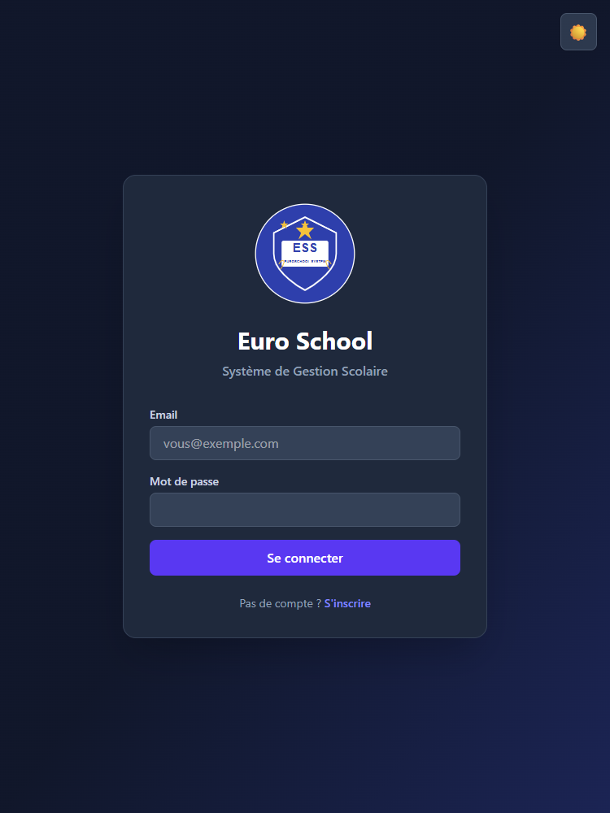
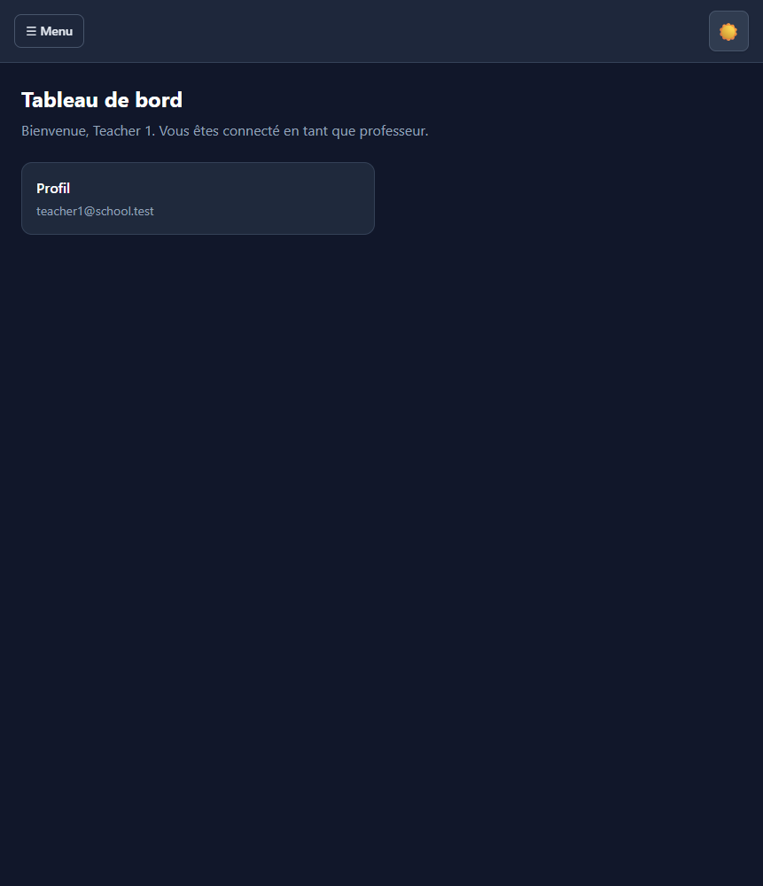
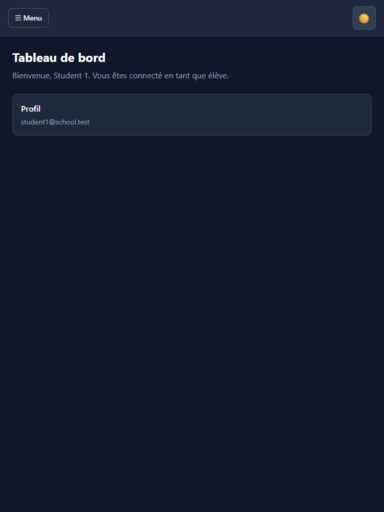

# Manuel Utilisateur - Euro School

## 1. Connexion et navigation

- Ouvrir l'application et se connecter avec email + mot de passe.
- En cas de session expirée, se reconnecter via la page de connexion.
- Le menu latéral s'adapte automatiquement au role de l'utilisateur.

### Menus communs

- `Tableau de bord` : vue principale selon le role.
- `Calendrier` : planning des cours.
- `Deconnexion` : bouton en bas du menu.

---

## 2. Manuel Administrateur

### 2.1 Tableau de bord admin

- Acceder a `Tableau de bord Admin`.
- Consulter les indicateurs clefs : eleves, paiements, factures, abonnements.

### 2.2 Gestion des utilisateurs

- `Utilisateurs` : gestion complete des comptes.
- `Eleves` : vue dediee aux eleves.
- `Professeurs` : vue dediee aux professeurs.

### 2.3 Gestion pedagogique

- `Cours` : creer, modifier et organiser les cours.

### 2.4 Gestion financiere

- `Paiements` : suivi des reglements.
- `Factures` : gestion des factures.
- `Abonnements` : suivi des abonnements.

### 2.5 Gestion des ecoles

- `Ecoles` : creer, modifier, supprimer.
- `Depenses ecole` : suivi des depenses par ecole.

### 2.6 Suivi des absences

- Depuis la liste des eleves, ouvrir le detail des absences d'un etudiant.

---

## 3. Manuel Professeur

### 3.1 Acces aux cours

- Aller dans `Gerer les cours`.
- Ouvrir un cours pour consulter ses seances.

### 3.2 Creation de seance

1. Ouvrir la page des seances d'un cours.
2. Saisir la date de seance.
3. Ajouter des notes (optionnel).
4. Enregistrer.

### 3.3 Enregistrement des presences

1. Ouvrir la seance.
2. Pour chaque eleve, choisir un statut :
   - Present
   - Absent
   - Retard
   - Excuse
3. Cliquer sur enregistrer les presences.

### 3.4 Bonnes pratiques

- Creer la seance le jour meme avant l'appel.
- Verifier tous les statuts avant sauvegarde.
- Ajouter des notes pour les cas particuliers.

---

## 4. Manuel Eleve

### 4.1 Tableau de bord

- Consulter ses informations et ses cours.

### 4.2 Catalogue des cours

- Ouvrir `Catalogue des cours`.
- Parcourir les cours disponibles.
- S'inscrire selon les options disponibles.

### 4.3 Calendrier

- Verifier les dates des cours et seances.

### 4.4 Regles d'usage

- Utiliser uniquement son propre compte.
- Consulter regulierement les mises a jour.

---

## 5. Depannage rapide

### Redirection vers la connexion

- Cause probable : session expiree.
- Action : se reconnecter.

### Page inaccessible

- Cause probable : permissions du role insuffisantes.
- Action : verifier le compte utilise.

### Donnees manquantes

- Cause probable : base non migree ou non peuplee.
- Action : verifier migrations et seeders.

---

## 6. Support

Pour signaler un probleme, transmettre :

- le role utilisateur (admin/professeur/eleve),
- la page concernee,
- l'heure de l'incident,
- une capture d'ecran du message d'erreur.

